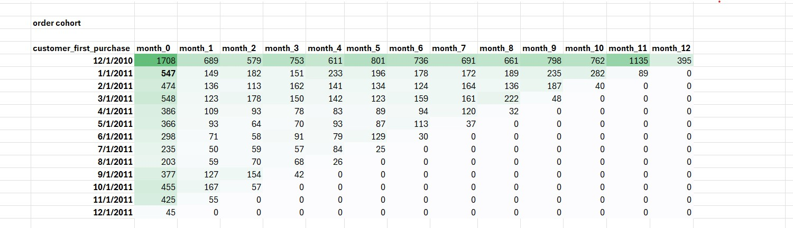
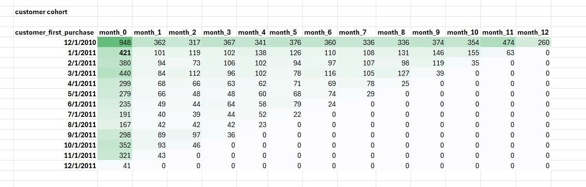
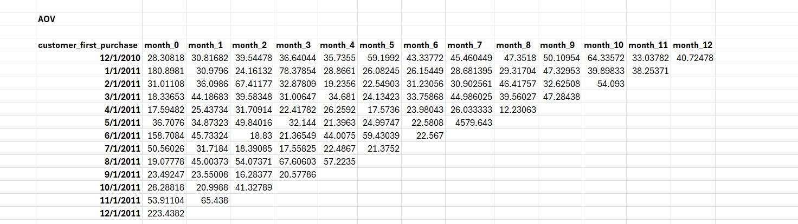
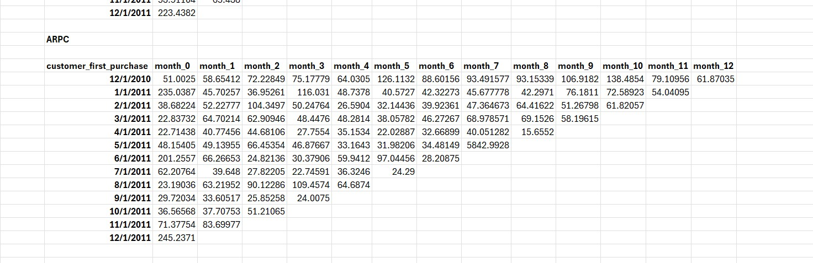

# SQL-Cohort-Analysis-Customer-Order-Revenue
SQL and Excel-based cohort analysis project analyzing customer retention, order behavior, revenue cohorts, AOV, and average revenue per order over time.
SQL Cohort Analysis for E-Commerce Customer Behavior

Project Overview

This project is a SQL-based cohort analysis project using PostgreSQL and Excel. The main goal of this project is to analyze customer behavior over time by grouping customers based on their first purchase month.

In this project, I performed different types of cohort analysis:

* Order Cohort
* Customer Cohort
* Revenue Cohort
* Retention Percentage
* Average Order Value Analysis
* Average Revenue Per Customer Analysis

Cohort analysis is very important for e-commerce businesses because it helps understand what happens after a customer makes the first purchase. It shows whether customers continue buying, how many orders they place, how much revenue they generate, and how customer retention changes over time.

⸻

Business Problem

E-commerce businesses often look at total sales, total orders, and total customers. However, these numbers do not fully explain customer behavior over time.

A company may know total revenue, but it may not know:

* Which monthly customer group generated the most revenue
* Whether customers are returning after their first purchase
* Which customer cohort has better retention
* Which cohort has higher order volume
* Whether revenue is coming from new customers or repeat customers
* How average order value changes over time
* How average revenue per customer changes after the first purchase

Without cohort analysis, it is difficult to understand customer retention, repeat purchase behavior, customer value, and long-term business performance.

⸻

Project Objective

The main objectives of this project are:

* Identify each customer’s first purchase month.
* Group customers into monthly cohorts.
* Track customer behavior from month 0 to month 12.
* Analyze order behavior by cohort.
* Analyze customer retention by cohort.
* Analyze revenue generation by cohort.
* Calculate retention percentage.
* Calculate Average Order Value.
* Calculate Average Revenue Per Customer.
* Generate business insights from cohort results.
* Provide business recommendations for improving retention and revenue.

⸻

Tools Used

Tool	Purpose
PostgreSQL	Data extraction, transformation, and cohort calculation
pgAdmin	Writing and executing SQL queries
Excel	Formatting output and creating heatmap-style cohort tables
GitHub	Project documentation and portfolio presentation

⸻

Dataset Information

The analysis was performed using an e-commerce retail dataset stored in PostgreSQL.

Main table used:

public.online_retail_data

Important columns used in this project:

Column Name	Description
invoiceno	Unique invoice or order number
invoicedate	Date of transaction
customerid	Unique customer identifier
quantity	Number of products purchased
unitprice	Price per product

Revenue was calculated using:

unitprice * quantity

⸻

What is Cohort Analysis?

Cohort analysis is a method of grouping customers based on a shared starting point and then tracking their behavior over time.

In this project, customers were grouped based on their first purchase month.

For example:

If a customer first purchased in January 2011, that customer belongs to the January 2011 cohort. Then, the customer’s future orders, purchases, revenue, and retention are tracked across the following months.

⸻

Meaning of Month 0, Month 1, Month 2

Cohort Month	Meaning
Month 0	The month when the customer made the first purchase
Month 1	One month after the first purchase
Month 2	Two months after the first purchase
Month 3	Three months after the first purchase
Month 12	Twelve months after the first purchase

This structure helps the business understand how customers behave after acquisition.

⸻

SQL Process Explanation

The full SQL process was completed using multiple CTEs.

A CTE means Common Table Expression. It helps divide a complex SQL query into smaller, readable, and logical steps.

In this project, CTEs were used to:

* Prepare the base transaction data
* Calculate revenue
* Identify each customer’s first purchase month
* Identify each transaction’s purchase month
* Calculate month difference between first purchase and later purchases
* Create cohort tables
* Calculate order, customer, revenue, retention, AOV, and ARPC metrics

⸻

Part 1: Order Cohort Analysis

Purpose of Order Cohort

The order cohort analysis shows how many orders were placed by each customer cohort from month 0 to month 12.

This analysis helps the business understand repeat order behavior.

For example, if the January 2011 cohort placed many orders in month 3 or month 6, it means that customers acquired in January continued purchasing in later months.

⸻

SQL Stage 1: Creating cte1

In the first CTE, the necessary columns were selected from the main dataset.

The selected columns were:

* invoiceno
* invoicedate
* customerid
* revenue

Revenue was calculated using:

ROUND((unitprice::numeric * quantity), 2) AS revenue

Why cte1 was used

cte1 was used to prepare the base transaction-level dataset.

Instead of working with all columns from the raw table, this CTE selected only the required fields for cohort analysis.

Business meaning

This step prepares the transactional data needed to analyze customer orders, purchase months, and revenue behavior.

⸻

SQL Stage 2: Creating cte2

In cte2, two important monthly fields were created:

* customer_first_purchase
* purchase_month

customer_first_purchase means the first month when a customer made a purchase.

purchase_month means the month of each transaction.

The first purchase month was calculated using a window function:

MIN(invoicedate) OVER (PARTITION BY customerid ORDER BY invoicedate)

Why window function was used

A window function was used because one customer can have multiple purchase records. The query needed to find the first purchase date for each customer while still keeping the transaction-level rows.

Why PARTITION BY customerid was used

PARTITION BY customerid separates the data customer by customer.

This means the first purchase month is calculated separately for each customer.

Why to_char was used

to_char was used to convert invoice dates into monthly format.

This helped group transactions by month instead of individual dates.

Business meaning

This step identifies when each customer started their journey with the business.

⸻

SQL Stage 3: Creating cte3

In cte3, the month difference between purchase_month and customer_first_purchase was calculated.

The logic used was:

EXTRACT(YEAR FROM age(purchase_month::date, customer_first_purchase::date)) * 12 + EXTRACT(MONTH FROM age(purchase_month::date, customer_first_purchase::date)) AS month_

Why this calculation was used

This formula converts the time difference between the first purchase month and later purchase months into month numbers.

Example:

First Purchase Month	Purchase Month	Cohort Month
January 2011	        January 2011	   Month 0
January 2011	        February 2011	   Month 1
January 2011	        March 2011	     Month 2

Business meaning

This step creates the main cohort timeline. It allows the business to track customer behavior month by month after the first purchase.

⸻

SQL Stage 4: Final Order Cohort Query

The final order cohort query used conditional aggregation.

The logic was:

COUNT(DISTINCT CASE WHEN month_ = 0 THEN invoiceno ELSE NULL END) AS month_0

This same logic was repeated from month_0 to month_12.

Why CASE WHEN was used

CASE WHEN was used to place each order into the correct cohort month.

Why COUNT(DISTINCT invoiceno) was used

COUNT(DISTINCT invoiceno) was used because the analysis measures the number of unique orders.

A single invoice can have multiple product rows, so distinct invoice count gives the correct order count.

Why GROUP BY customer_first_purchase was used

GROUP BY customer_first_purchase was used to create one row for each monthly cohort.

Business meaning

The order cohort helps identify which customer groups continued placing orders after their first purchase.

⸻

Part 2: Customer Cohort Analysis

Purpose of Customer Cohort

Customer cohort analysis shows how many unique customers from each cohort returned and purchased again in later months.

This is useful for understanding customer retention and repeat purchase behavior.

⸻

SQL Process

The customer cohort analysis followed the same CTE structure as the order cohort:

* cte1 prepared transaction-level data.
* cte2 calculated customer first purchase month and purchase month.
* cte3 calculated the month difference.
* The final query counted distinct customers by cohort month.

The final logic used:

COUNT(DISTINCT CASE WHEN month_ = 0 THEN customerid ELSE NULL END) AS month_0

This same logic was repeated from month_0 to month_12.

Why COUNT(DISTINCT customerid) was used

COUNT(DISTINCT customerid) was used to measure how many unique customers were active in each cohort month.

Difference between Order Cohort and Customer Cohort

Analysis Type	Counting Logic	Meaning
Order Cohort	Counts distinct invoices	Shows order volume
Customer Cohort	Counts distinct customers	Shows returning customers

Business meaning

Customer cohort analysis helps the business understand whether customers are coming back after their first purchase.

If customer count drops sharply after month 0, it means many customers are not returning.

⸻

Part 3: Revenue Cohort Analysis

Purpose of Revenue Cohort

Revenue cohort analysis shows how much revenue each customer cohort generated from month 0 to month 12.

This helps the business understand which customer acquisition months generated the highest revenue over time.

⸻

SQL Process

The revenue cohort analysis used the same CTE structure:

* cte1 calculated revenue from quantity and unit price.
* cte2 calculated customer first purchase month and purchase month.
* cte3 calculated the cohort month number.
* The final query summed revenue by cohort month.

The final logic used:

SUM(DISTINCT CASE WHEN month_ = 0 THEN revenue ELSE NULL END) AS month_0

For later months, COALESCE was used to replace null values with 0.

Example:

COALESCE(SUM(DISTINCT CASE WHEN month_ = 1 THEN revenue ELSE NULL END), 0) AS month_1

Why SUM was used

SUM was used because this analysis measures total revenue.

Why COALESCE was used

COALESCE was used to show 0 instead of blank or null values.

This makes the final cohort table cleaner and easier to understand.

Business meaning

Revenue cohort analysis shows which customer groups generated the most money after acquisition.

It also helps the business identify whether revenue is coming from initial purchases or repeat purchases.

⸻

Part 4: Retention Percentage Analysis

Purpose of Retention Percentage

Retention percentage shows what percentage of customers from each cohort returned in later months.

Retention percentage is one of the most important metrics in cohort analysis because it directly shows customer loyalty and repeat engagement.

Formula:

Retention Percentage = Customers in Month N / Customers in Month 0 * 100

SQL Logic

Retention percentage was calculated using customer cohort results.

For each cohort, month 0 was treated as the base customer count.

Then, each future month was divided by month 0 to calculate the percentage of returning customers.

Business meaning

Retention percentage helps answer questions like:

* How many customers returned after the first month?
* Which cohort retained customers better?
* Where does customer drop-off happen?
* Is customer loyalty improving or declining over time?

A high retention percentage means customers are continuing to purchase after the first month.

A low retention percentage means customers are not returning regularly.

⸻

Part 5: AOV Analysis

What is AOV?

AOV means Average Order Value.

It shows the average revenue generated from each order.

Formula:

AOV = Total Revenue / Total Orders

Purpose of AOV Analysis

AOV analysis helps the business understand how much customers spend per order across different cohort months.

If AOV increases, the business can generate more revenue without increasing the number of orders.

SQL Logic

AOV was calculated by dividing revenue cohort values by order cohort values.

The logic is:

AOV = Revenue / Number of Orders

Business meaning

AOV helps answer questions like:

* Which cohort spends more per order?
* Does spending increase after the first purchase?
* Are returning customers placing higher-value orders?
* Which cohort month has the best revenue efficiency?

If AOV is high, customers are spending more per transaction.

If AOV is low, the business may need upselling, bundling, or product recommendation strategies.

⸻

Part 6: ARPC Analysis

What is ARPC?

ARPC means Average Revenue Per Customer.

It shows how much revenue is generated per customer.

Formula:

ARPC = Total Revenue / Number of Customers

Purpose of ARPC Analysis

ARPC helps understand customer value at cohort level.

While AOV focuses on revenue per order, ARPC focuses on revenue per customer.

Difference between AOV and ARPC

Metric	Formula	Meaning
AOV	Revenue / Orders	Average revenue per order
ARPC	Revenue / Customers	Average revenue per customer

Business meaning

ARPC helps answer questions like:

* Which cohort has the most valuable customers?
* Are customers spending more over time?
* Which acquisition month brought higher-value customers?
* Which cohort should receive more marketing attention?

A high ARPC means each customer is generating more revenue.

A low ARPC means the business may need better customer engagement, product recommendation, and retention strategies.

⸻

Key Business Insights

1. Customer retention drops after the first purchase

The retention percentage shows that most cohorts have a significant drop after month 0. This means many customers purchase once but do not return regularly.

This is a common issue in e-commerce businesses and indicates that the company should focus on repeat purchase strategies.

⸻

2. The December 2010 cohort performed strongly

The December 2010 cohort had a large number of customers and orders in month 0 and also continued to show activity in later months.

This indicates that this cohort had stronger long-term engagement compared to many later cohorts.

⸻

3. Some cohorts show strong revenue even with fewer customers

Revenue cohort results show that some months generated high revenue even when the number of customers or orders was not the highest.

This means some cohorts may include high-value customers who spend more per purchase.

⸻

4. Retention is inconsistent across cohorts

Some cohorts retained customers better than others. For example, some cohorts showed better activity in later months, while others dropped quickly.

This may be caused by seasonal behavior, marketing campaigns, customer acquisition quality, product demand, or discount offers.

⸻

5. Later cohorts have fewer months of data

Cohorts from later months have fewer future months available for tracking. For example, a December 2011 cohort cannot have 12 months of future activity if the dataset ends shortly after.

This should be considered when comparing early cohorts with later cohorts.

⸻

6. AOV and ARPC help identify high-value cohorts

Order count and customer count alone do not show full business value.

A cohort with fewer customers may still generate strong revenue if AOV or ARPC is high.

This means the business should not only focus on customer volume but also on customer quality.

⸻

7. Repeat purchase behavior needs improvement

Customer cohort and retention percentage indicate that many customers do not continue purchasing consistently after their first purchase.

This suggests the business needs stronger post-purchase engagement.

⸻

Business Recommendations

1. Improve first-month retention

Since many customers drop after month 0, the business should focus on converting first-time buyers into repeat buyers.

Recommended actions:

* Send thank-you emails after first purchase
* Offer second-purchase discount codes
* Recommend related products
* Send reminder campaigns within 15 to 30 days
* Provide loyalty points after first order

⸻

2. Create cohort-based marketing campaigns

Different cohorts behave differently, so the same marketing strategy should not be used for all customers.

Recommended actions:

* Identify cohorts with low retention and target them with reactivation offers
* Identify high-value cohorts and provide premium offers
* Create separate campaigns for new, active, and inactive customers
* Track campaign performance by cohort month

⸻

3. Increase repeat purchase frequency

The order cohort shows how customer orders change over time. If repeat orders are low, the company should encourage customers to buy more frequently.

Recommended actions:

* Use subscription offers
* Create bundle deals
* Offer free delivery after a minimum order value
* Send product replenishment reminders
* Use personalized product recommendations

⸻

4. Improve Average Order Value

AOV analysis helps identify whether customers are spending enough per order.

Recommended actions:

* Recommend complementary products
* Use cross-selling strategies
* Use upselling strategies
* Offer bundle discounts
* Create minimum order value offers for free shipping

⸻

5. Focus on high ARPC cohorts

High ARPC cohorts bring more revenue per customer. These customers should receive more attention because they generate better business value.

Recommended actions:

* Create VIP customer campaigns
* Offer exclusive deals
* Provide early access to new products
* Send personalized premium product recommendations
* Retain high-value customers with loyalty benefits

⸻

6. Investigate low-performing cohorts

Some cohorts show weak retention, low revenue, or low order volume. These cohorts should be analyzed further.

Possible reasons:

* Poor customer acquisition quality
* Weak product-market fit
* Seasonal customers
* Discount-only customers
* Lack of post-purchase engagement
* Poor customer experience

Recommended actions:

* Compare marketing channels by cohort
* Check product categories purchased by each cohort
* Analyze refund or cancellation behavior
* Compare discount usage by cohort
* Review customer feedback

⸻

7. Build a retention dashboard

The business should create a dashboard to monitor cohort performance regularly.

Important dashboard metrics:

* Customer cohort count
* Order cohort count
* Revenue cohort
* Retention percentage
* AOV
* ARPC
* Repeat purchase rate
* Customer drop-off by month

⸻

Strategic Business Actions

Short-Term Actions

* Launch second-purchase discount campaigns.
* Send reactivation emails to customers who did not return after month 1.
* Identify high AOV cohorts and promote similar products.
* Create customer segments based on retention behavior.
* Use personalized recommendations after first purchase.

Medium-Term Actions

* Build automated cohort tracking reports.
* Create retention campaigns based on cohort month.
* Improve loyalty programs.
* Monitor monthly retention percentage.
* Track AOV and ARPC by cohort.

Long-Term Actions

* Use cohort analysis for customer lifetime value prediction.
* Connect cohort behavior with marketing channels.
* Build advanced customer segmentation.
* Forecast future revenue using cohort trends.
* Improve customer acquisition quality based on cohort performance.

⸻

SQL Concepts Used

SQL Concept	Purpose
CTE	Used to break the query into readable stages
Window Function	Used to calculate each customer’s first purchase month
PARTITION BY	Used to calculate first purchase separately for each customer
MIN	Used to find the first purchase date
to_char	Used to convert dates into monthly format
EXTRACT	Used to calculate year and month difference
AGE	Used to calculate time difference between two dates
CASE WHEN	Used for conditional aggregation
COUNT DISTINCT	Used to count unique orders and customers
SUM	Used to calculate revenue
COALESCE	Used to replace null values with 0
GROUP BY	Used to group results by customer first purchase month
ROUND	Used to format revenue and calculated values

⸻

Project Workflow

Raw E-Commerce Transaction Data
↓
Select Required Columns
↓
Calculate Revenue
↓
Identify Customer First Purchase Month
↓
Identify Purchase Month
↓
Calculate Month Difference
↓
Create Order Cohort
↓
Create Customer Cohort
↓
Create Revenue Cohort
↓
Calculate Retention Percentage
↓
Calculate AOV
↓
Calculate ARPC
↓
Generate Business Insights and Recommendations

⸻

Business Value of This Project

This project helps an e-commerce business to:

* Understand customer behavior after first purchase
* Measure customer retention
* Identify high-value customer cohorts
* Track repeat purchase behavior
* Analyze revenue contribution over time
* Improve customer engagement strategy
* Increase repeat purchases
* Improve average order value
* Improve customer lifetime value
* Make data-driven marketing decisions

⸻

Conclusion

This SQL cohort analysis project shows how PostgreSQL can be used to analyze customer behavior over time.

By grouping customers based on their first purchase month, this project helps identify customer retention patterns, repeat purchase behavior, revenue contribution, average order value, and average revenue per customer.

The analysis provides important business insights that can help an e-commerce company improve retention, increase revenue, and make better data-driven marketing decisions.

This project demonstrates practical skills in SQL, cohort analysis, customer analytics, revenue analysis, Excel reporting, and business decision-making.
